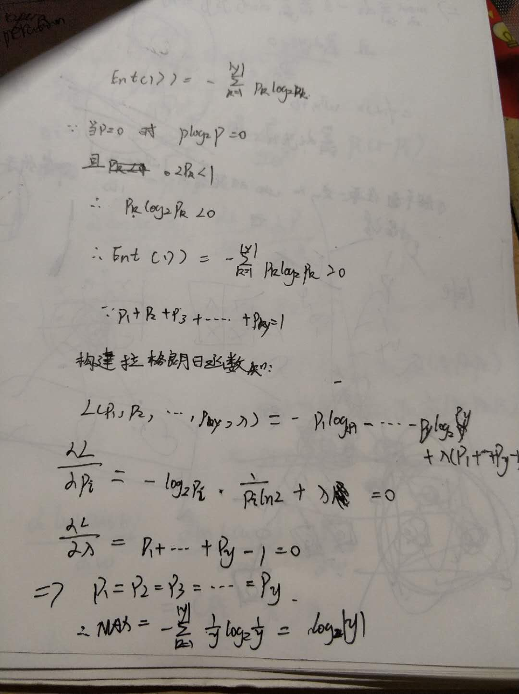
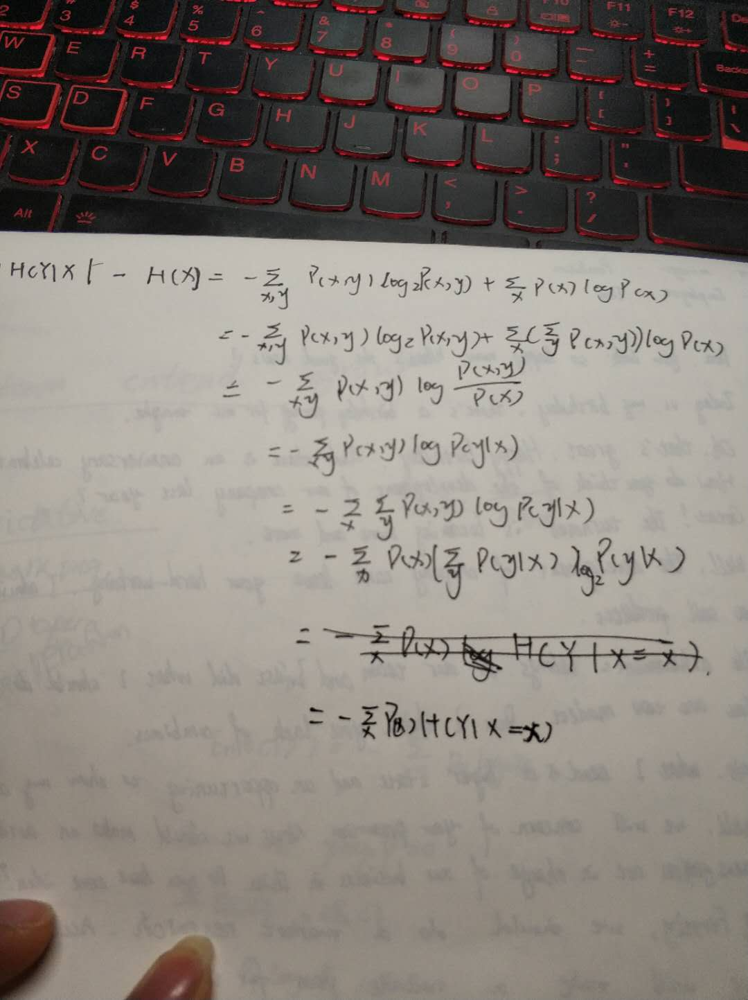

# 李宏毅打卡第七次

## 信息量计算，原理
首先我们要知道什么是信息量

信息量
> 是一个用来描述东西包含的信息的多寡，越是确定的信息，信息量就越少。

## 信息熵
熵 (entropy) 这一词最初来源于热力学，是一种描述物体混乱程度的度量。宇宙间的物体总是趋向于熵增加的。也就是趋向于更为混乱的成都。

接下来我们就引入信息熵，也就是常说的香农熵。

“信息熵”（information entropy）
> 是度量样本集合纯度的最常用的一种指标。

假设当样本前集合D中第k类样本所占的比例为$p_k$（k = 1，2，3……，|y|），则D的信息熵定义为：

$$Ent(D) = - \sum_{k=1}^{|y|}p_klog_2p_k$$

## 证明0 \leqslant H(p) \leqslant logn

## 联合概率，边缘概率

本来想在课本上找到解释的，但是好像没有找到我需要的，我只能自己解释一波。

我们一般知道对于某件事情的概率标记为P(X)，这意味着这是事件X发生的概率大小，而联合概率就是对于事件X,Y它们发生的概率为P(X,Y)，特别的，如果X和Y是独立的，那么P(X,Y) = P(X) * P(Y)。

然后什么是边缘概率呢？我们由上面知道了联合概率，那么边缘概率就是我们不管某一个变量算出来的概率，比如我们不关注X算出来的概率P(X,Y)就是Y的边缘概率，而这个时候P(X,Y1) = P(X1,Y1) + P(X2,Y2) …… P(XN,Y1)（其实写成积分形式的概率密度函数似乎更好些）

## 联合熵，条件熵，条件熵公式推导

联合熵指的是：对于服从联合分布P(X,Y)的一堆离散变量(X,Y),其联合熵表示为：$$H(X,Y) = -\sum_{x \in X} \sum_{y \in Y} P(x,y)log_2P(x,y)$$

条件熵指的是：当前有联合概率分布为P(X,Y)，条件熵H(Y|X)指的是在X确定的条件下，随机变量Y的不确定性，随机变量X给定的条件下随机变量Y的条件熵H(Y|X)，定义为X给定条件下Y的条件概率分布的熵对X的数学期望，也就是：
$$H(Y|X) = \sum_{i=1}^{m}p_iH(Y|X = x_i)$$

对于条件熵公式推导:

## 互信息，互信息公式推导
互信息指的是两个随机变量x,y的联合分布乘以独立分布，是用来两个随机变量的“相关性”，公式如下：

$$I(X,Y) = \sum_{xy}P(x,y)log_2{\frac{P(x,y)}{P(x)P(y)}}$$

定义式的推导：

emmm

## 相对熵，交叉熵

如果我们对于同一个随机变量 x 有两个单独的概率分布 P(x) 和 Q(x)，我们可以使用 KL 散度来衡量这两个分布的差异，具体做法是P(X),Q(X)的比值取对数之后，在P(X)的概率分布上求期望：

$$D(P|Q) = \sum_x P(x)log2 {\frac{P(x)}{Q(x)}}$$

相对熵可以度量两个随机变量的“距离”

交叉熵：

$$D(P|Q) = \sum_x P(x)log2 {\frac{P(x)}{Q(x)}} = -H(P) + (-\sum_x P(x)log_2 Q(x))$$

前一部分是p的熵，后一部分就是交叉熵

## 回顾LR中的交叉熵

其中交叉熵的部分计算为：

$$L(θ) = \sum_{i=1}^m (-y^i log_2 {h_θ(x^i)+ (1 - y^i)(1 - log_2 {h_θ(x^i)})}$$

用来度量两个分布之间的差异成都。

## 计算给定数据集中的香农熵
	
	import math
	
	def get_data(name):
	    with open(name,"r") as f:
	        data = f.readlines()
	    length = 0
	    for i in range(len(data)):
	        data[i] = data[i].strip()
	        length += len(data[i])
	    return data,length
	
	if __name__ == '__main__':
	    name = "watermelon_3a.csv"
	    data , length = get_data(name)
	    all = {}
	    for i in data:
	        for j in i:
	            if not j in all.keys():
	                all[j] = 0
	            else:
	                all[j] += 1
	    Ent = 0
	    for i in all.keys():
	        if all[i]/length == 0:
	            Ent += 0
	        else:
	            Ent += -all[i]/length * math.log(all[i]/length) / math.log(2)
	    print(Ent)