# [李宏毅机器学习（第一天打卡）](https://www.bilibili.com/video/av35932863?t=1336)
## P1 Introduction of Machine Learning

### 人类设定的规则（Han-crafted rules）
>这个讲的是专家系统的时候，也就是人类把已经有的规则给输入到系统里面，

### 什么是Machine Learning？
> Looking for a Function From Data

### Machine Learning的三个步骤：

### 以下是学习图：

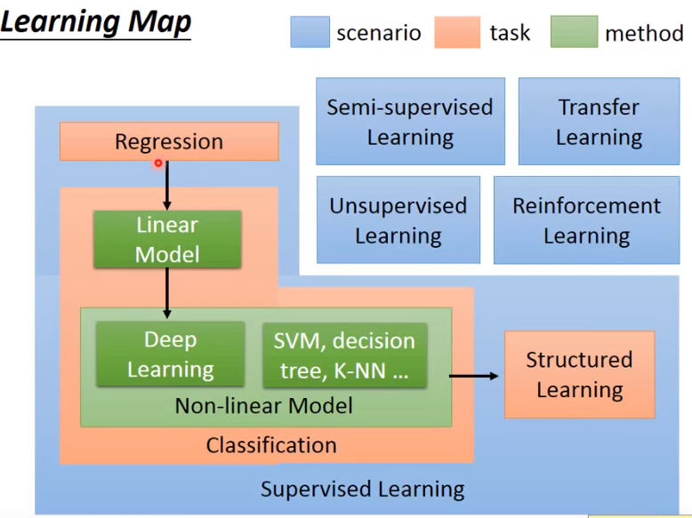

### Regression:回归
>输出一个数值

### Classification
> 二元分类

> 多元分类

### Supervised Learning
>往往需要很大量的label

### Semi-supervised Learning
> 可以减小data用量

### Transfer Learning
>应该是迁移学习吧，这个东西，但是课程没有细讲

### Unsupervised Learning

### Structured Learning
>输出的是一个复杂的部件

例子：

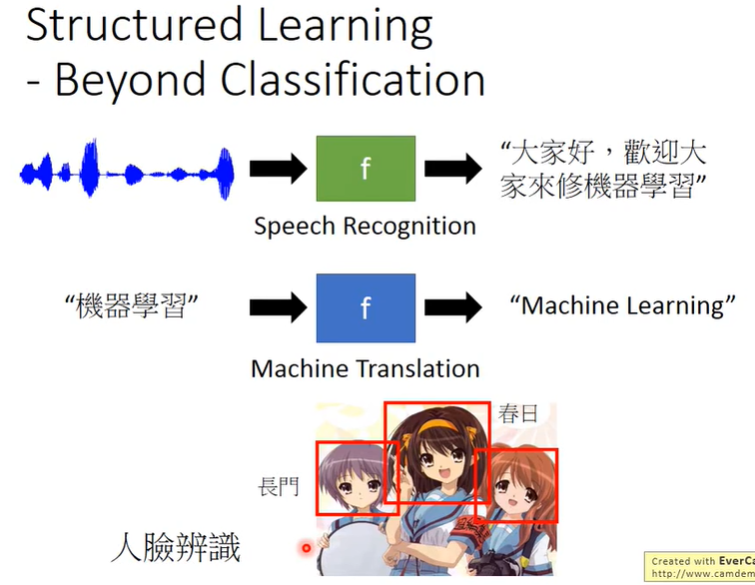

>虽然之前一直不知道有这个名字，但是这些任务好像现在都是有神经网络来实现的
>
>形成句子：RNN、LSTM方向的
>
>目标检测：CNN、SSD、YOLO方向的（当然，也有传统的RPO+其他层的方法，不过我不是很了解传统的做法）

### Reinforcement Learning
> 强化学习
> 在强化学习中并没有比较明确的label、答案什么的，只有对于最后的结果的评价是好的，还是坏的，并不知道那里是错误的。
> 举个详细的例子就是，你学完一门课程之后，考试挂了，你只知道你考的不好，但是你不知道你哪里学的不好（虽然感觉例子还是不够好，大致了解以下就好了）

## P1 Regression - Case Study

### 第一个例子预测宝可梦的CP值（感觉老师太可爱了）
> 敲黑板，老师说这是一个非常实用的例子，请大家认真（手动滑稽~

X表示一个宝可梦

- $X_{cp}$是进化前的CP
- $X_s$种类
- $X_{hp}$是hp
- $X_w$重量
- $x_h$高度

### Step 1: Model
首先胡乱写一个 y = b + w * x_cp

这是一个Liner model： y = b + \sum{w_i * x_i}

### Step 2: Goodness of Function
>Loss function L
>这里用的是L2范式，也就是平方误差

### Step 3:Gradient Descent
> 条件：只要损失函数是可微分的
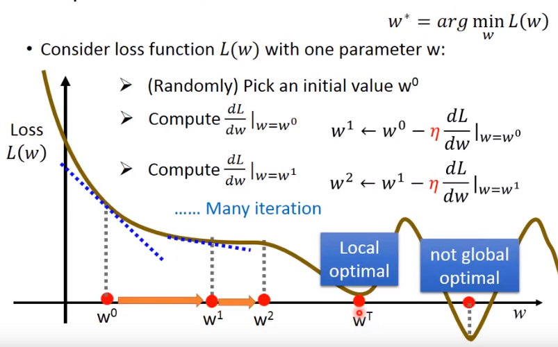
使用减是因为w增加时，微分是负的

效果不够好，我们挑选其他的模型，比如
$y = b + w_1*x_{cp} + w_2 * (x_{cp})^2$

train 中模型越复杂准确率越低，但是test不一定提高，很好理解不解释了，可以看作overfitting的一种

后面复杂之后，变成了使用矩阵的的样子，就是让X = 【1，0，1，0……】什么的，让不同的物种（宝可梦）有不同的b和w

如果不知道什么对结果有影响的话，就把所有的数据都放进去，搞成一个很复杂的模型。

再加入正则化(Regularization)

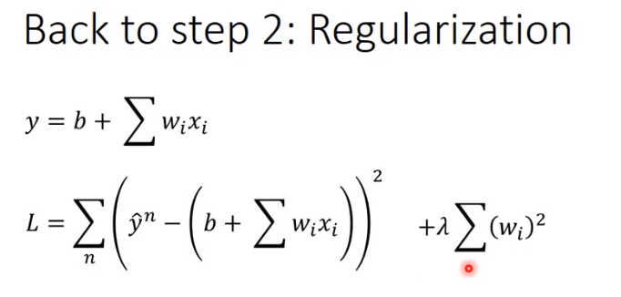

期待一个参数接近于0的function，参数接近0的function是比较平滑的（output对于4input不是那么敏感）

## 中心极限定理
### 1.什么是中心极限定理？

我第一次接触到这个定理的时候，是在上概统课的老师说了一句话
>“根据中心极限定理，我们知道这个正态分布的”。

当时我就非常的好奇了，中心极限定理到底是什么?为什么通过它来确定数据是正态分布的呢？

### 2.首先给大家一个比较通俗的解释，这是比较容易理解的
>中心极限定理是概率论中的一组重要定理，它的中心思想是无论是什么分布的数据，当我们从中抽取相互独立的随机样本，且采集的样本足够多时，样本均值的分布将收敛于正态分布

### 3.课本中的解释
然后我翻了一下我们当时上课的课本，找到了课本中的解释。

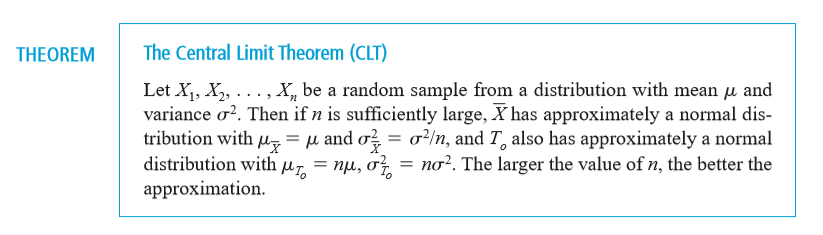

### 4.开始强行解释
在你看完课本的概念之后，我觉得你会一脸懵逼的，因为这个定理告诉了你这一点其实和我给的通俗的理解是一个鬼样的。

一般看完之后顶多就来一句，“嗯，我知道了”，如果要你证明的话，估计你会
>这也能证？

或者
>这也用证？

不过很抱歉，这东西还真可以证明，就好像“天下没有免费午餐”这个定理也是可以证明的道理是一样的。

### 5.开始证明

在证明这个的时候我其实也是一脸懵逼的，我的第一个反应就是“这也用证?”。

不过我们废话不多说我们开始证明(因为我懒得在电脑上打公式了，所以下面的证明我都是用手写然后拍照的。)，而且证明的时候需要一点的高数基础就能够看得懂和理解，非常的简单。

## 正态分布
>满足如下条件的是正态分布。
>因为正态分布的导出是在太过复杂，在数学史上花费了很多年最后才实现的事情，所以在这里不进行推到了。
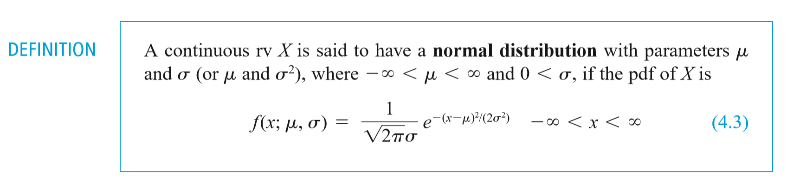

## 标准正态分布

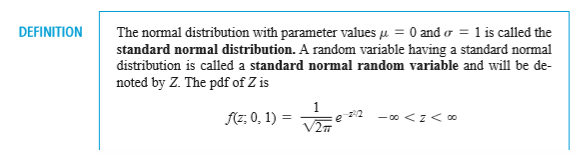

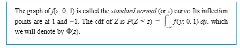

## 最大似然估计

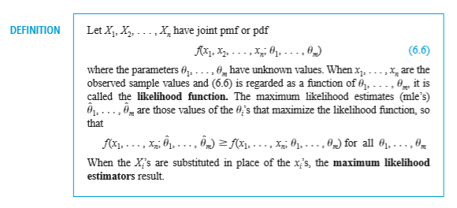

>本来想要推导一下，但是发现定义已经讲的很清楚了

>我们所需要做的仅仅只是将θ1 、θ2 ……，θn = argmax f(x_1,x_2,……,x_n|θ1，θ2，……，θn)展开
>然后我们对其进行求导数，然后找出最大值即可。

## 推导loss function（本此课上的线性模型的损失函数）
>本来一开始想着没有什么好推导的也就是L2范数而已
>
>可是后来仔细思考一下，越想越觉得不对劲，然后就手动进行推导了一下，发现还有地方需要进行思考的，有些东西并不是所想的显而易见。

## 学习损失函数和凸函数之间的关系
> 什么是凸函数，简单来说就是一个切线在函数的上方就是凸函数，也就是说函数是下凹的，形如下面：

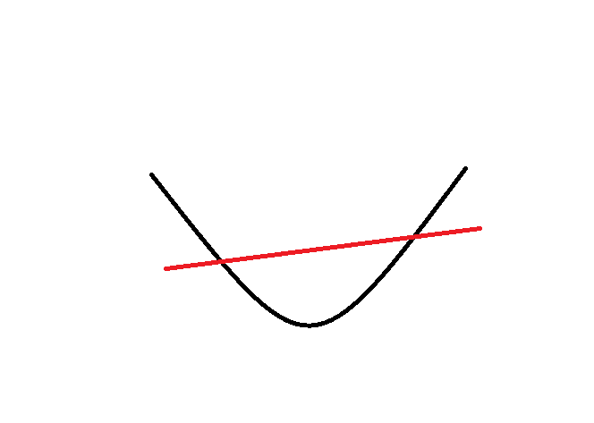

然后为什么损失函数会和凸函数产生关系呢？
>看了很多地方并没有对这两者之间的关系阐述的很清楚，或者说也没有必要进行很清晰的阐述，两者是定义在不同范围上的概念

>损失函数是学习算法中对于预测值和真实值误差的函数定义

>两者本来是没有关系，但是很多时候会发现很多算法的损失函数都尽量往凸函数方向靠，为什么呢？个人认为，是很多时候损失函数就是凸函数，我们可以直接往凸函数优化的理论来研究它。

## 了解全局最优和局部最优
> 什么是全局最优和局部最优呢？我们直接举个例子就可以清楚了

### 例子
如果我们的损失函数是如下的样子。

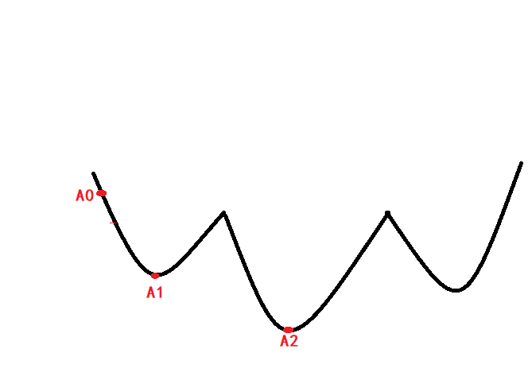

我们从A0点出发，这个时候找到的最优的损失函数自然就是A1了。

但是这个时候看完了整个函数的你自然会知道A1点不是最优的结果而A2点才是。

而如果有人还看到了后面的内容，说不定还有一个更优的点A3等等。

我们来想想为什么在你一开始的时候你会判断到A1不是最优的？因为你知道后面有更优的点A2，所以你知道A1点不是最优的。

而计算机在计算的时候，按照已有的方式进行计算，会算出A1是最优的，也就是说陷入的了局部的最优，如果我们看第一个凹的地方会发现在那个地方中A1是最优的。

但是如果我们看了整个函数（假设展示出来的就是整个函数了），我们可以知道A2才是最优的，而A2最优的这个结论是你在看了整个函数之后才得出的结果，也就是全局最优的。

## 学习导数，泰勒展开
导数是什么就不说了，还是直接讲泰勒展开吧，或者说泰勒级数。

$ f(x) = f(x_0) + f(x_0)^1(x - x_0) + \frac{f(x_0)^2}{2!} * (x - x_0)^2 + \frac{f(x_0)^3}{3!} * (x - x_0)^3  \dots + \frac{f(x_0)^2}{n!} * (x - x_0)^n$

### 推导梯度下降公式
我们首先写出Loss Function的式子

$J(\theta) = \frac{1}{2} * \sum_i^n (h_{\theta}(x^i) - y^i)$

>至于为什么乘以$\frac{1}{2}$，那是因为这样会使后面推导出来的结果好看一些，同时因为我们只是求取$\theta$的最小值，乘以$\frac{1}{2}$并不会影响最后的结果。

我们对其求在$\theta_j$时候的梯度。

$$\frac{\partial}{\partial\theta_j} J(\theta) = \frac{\partial}{\partial\theta_j} (\frac{1}{2} * \sum_i^n (h_{\theta}(x^i) - y^i))^2 $$

$$ = (h_{\theta}(x^i) - y^i) * \frac{\partial}{\partial\theta_j} (\sum_i^n (h_θ(x^i) - y^i))$$

$$= (h_{\theta}(x^i) - y^i) * x_j$$

### 写出梯度下降代码

	import numpy as np

	def get_grand(w,pre,rate,x,y):
    	return w + rate * (pre - y).T * x
    
## 学习L0、L1、L2范数

###  推导正则化公式

### 说明为什么用L1范式代替L0范式
> 对于L0范式，如果说要对L0范式进行优化的话，难度是NP的，也就是说是非常难的，但是我们可以使用更高的L1范式使得更加容易解出来。

### 学习为什么支队W/θ做出限制，不对b做限制
> b只是预测的截距，只影响函数的上下移动，而不对整体造成影响，所以对于b不做出限制。