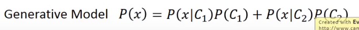
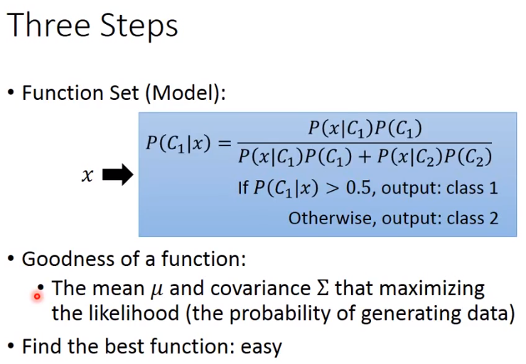
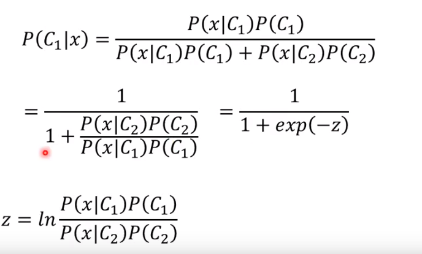
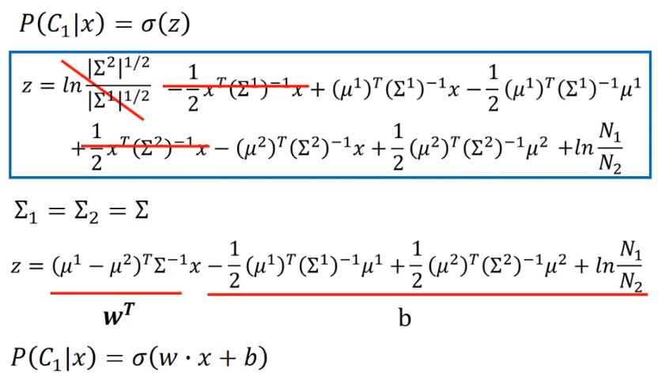
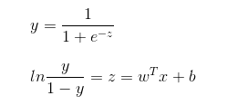

# 李宏毅第三次打卡
P8

## Classification

## How to do Classification

## Ideal Alternatives

### Function(Model)   f(x)
g(x) > 0 output = class1
else output = class2

### Loss function

L(f) = \sum (正确的个数)

全概率公式

使用极大似然估计

几率模型三个步骤

### Probability Distribution
可以任意选择自己喜欢的.

### 基础概率到贝叶斯和朴素贝叶斯的推论(深入浅出统计学示例改编)，

此时课看得到出它推成为了一个LR。

## LR和linear regression之间的区别
我们可以查一下一下对于广义线性回归的定义

$$y = g^{-1}(w^Tx+b)$$

我们有如下的转化