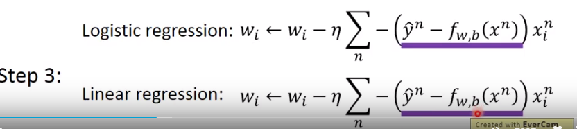

# 李宏毅第四次打卡
# P9 logit regression

## Step 1:Function Set

找一个$P_{w,b}(C_1|x)$

function set:

$f_{w,b}(x)$ = 

$p_{w,b}(C_1|x)$

对于对数几率回归，output函数的原因，所以是0-1之间的

## Step 2： Goodness of a Function

最优化w，b和，原本是最大化L找w，b，然后加个-号，找到最小的w和b

转化损失函数

## Step 3： Find the best function

分别进行偏微分，进行最小化

## Discriminative v.s. Generative

一般而言分类模型比生成模型要好

生成模型做了一些假设。

不是所有时候分类模型都优于生成模型，如果此时数据很小。

生成模型的data量对于generative模型的影响相对于分类模型比较小。

## Multi-class Classification

## Limitation of Logit Regression

对于异或问题是无法正确分类的。

## Feature Transformation
使用这个方法，使得对于异或问题可以正确可分。

转化一下feature。6

问题在于我们希望让电脑来进行feature转化

我们可以使用多个对数几率回归进行转化。

## 对于这两个的推导：LR损失函数(1) && 学习LR梯度下降(2)

## Softmax原理
## softmax损失函数
## softmax梯度下降

推荐一篇[好的关于softmax的链接](https://blog.csdn.net/ITleaks/article/details/80337855)
