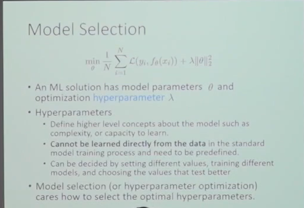

## Thinking in ML

- 监督学习
	- 预测问题
- 无监督学习
	- 分类问题，认知数据
- 强化学习
	- try error learn

## 监督学习

学习一个映射

定义损失函数，

Model Selection

Regularization

对于正则项的hyperparameter的调整

泛化误差边界证明：

机器学习的两套model：Discriminative model and Generative Model

Discriminative model：

- 拟合y的分布

Generative Model

- 拟合x、y的联合分布

两者的区别，辨别模型我只关注我的label，是针对于label进行误差优化的，而生成模型是关注于整个的多个维度的关系