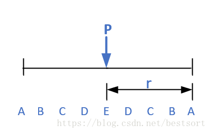
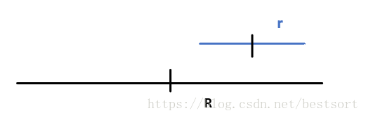
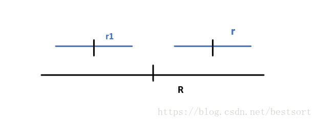
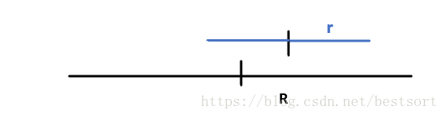
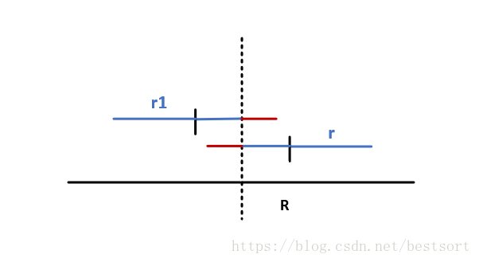
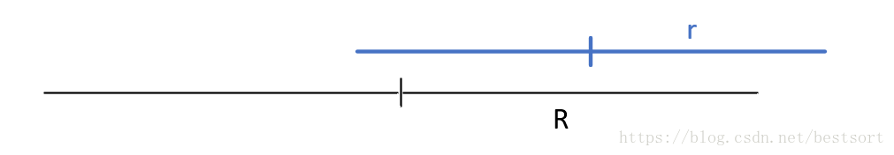
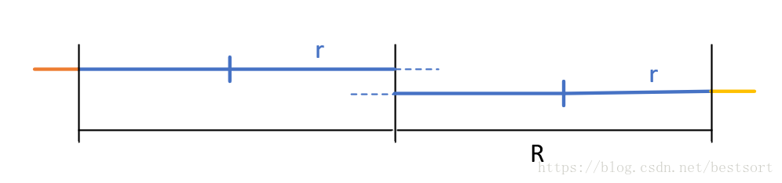

# Manacher算法

Manacher算法也称拉马车算法，这是一个用于求解最长回文子串的算法。

暴力方法时间复杂度为：O(n^3) 空间复杂度为O(1)的

中心拓展方法时间复杂度为O(n^2)，空间复杂度为O(1)的

中心拓展方法是指的是从每个字符串都判断其是不是回文字符串的中心，需要区别奇中心和偶中心进行判断。

然后最后是最厉害的Manacher算法了，他的时间复杂度是O（n）的，空间复杂度是O（n）的。

附上最长字符串的代码：

    string longestPalindrome(string s) {
        int len = 0,a;
        if(s == "")
            return "";
        if(s.length() == 1)
            return s;
        for(int i = 0;i < s.length();i++){
            int len1 = getLength(s,i,i);
            int len2 = getLength(s,i,i+1);
            if(len1 < len2)
                len1 = len2;
            if(len1 > len){
                a = i;
                len = len1;
            }
        }
    return s.substr(a-(len-1)/2,len);
    }
    int getLength(string s , int a ,int b){
        while(a >= 0 && b < s.length() && s[a] == s[b]){
            a -= 1;
            b += 1;
        }
        return b - a - 1;
    }

上面的数据	52 ms	104.4 MB。

它是怎么做的呢？

中心拓展法可以认为其有几个步骤：

- 1.选定当前字符为假设的回文串的中心
- 2.判定以当前为中心的是不是回文串，找出最大的回文串半径
- 3.回退回文串的半径为1
- 4.选择下一个字符为中心，然后重复第一步。

在这里拉马车算法做的实际上是把回退的步骤给优化了。

我们在此利用前面找到的最大的回文串进行查找。

最开始我们对字符串插入对于符号无关的字符，比如“#”；我们在这里就将abc插入成#a#b#c#，然后为了防止溢出（大家都这么说，我觉得主要还是循环开始为1应该能够体现这一个@的作用）在开头增加一个其他符号比如“@”，所以这里最后的abc插入之后为@#a#b#c#。

首先，什么是回文半径，如下：

假设maxR为最大回文半径的最右边界，flag是最大回文半径的中心。

我们假设最大的回文半径为R，当前的回文半径为r，然后就有如下的几种可能关系：

### 第一种：**r右端点<=R右端点&&r左端点>=R中心点**,如图：

因为这是在最大的回文半径里面，所有找到其左边对称的：

然后我们知道其左边的位置中心是2*flag - i，这个时候右边r的半径就是r1的半径了（当然这里在代码实现的时候会取两个的最小，防止越界（超出maxR）之类的问题），然后因为R左边的内容肯定已经查找过了，可以直接使用。

然后其实这个地方也不用考虑其作为中点的（这句话应该是恰当的，因为最大的R既然包括了r，这意味着在R之后是无法拓展为回文串了，意味着r是不可能拓展为一个更大的回文串的），所以在这里我认为这里的优势是能够利用之前已经找到过的回文串，能够利用之前找到的内容，而不需要重新的再次进行寻找。（感觉主要解决的是最大的回文串R内的小字符串中心的内容，然后还需要做的是让这个小中心左右拓展一下看看能不能够加长，不行就直接按照之前也就是对称轴左边已经的到的内容）

### 第二种 r右端点< R右端点&&r左端点< R中心点，如下图：

找到对称的

和上面一样r的回文半径就是r1的回文半径。

### 第三种 r右端点>R右端点

对称之后

这个时候我们需要求的就是黄色的部分，这个时候我们就需要对外进行拓展就好了。

伪代码如下;

	/*
	String:加'#'处理后的回文串
	MaxR:最长回文半径
	flag:最长回文半径对应的中心点下标
	cnt[i]:以i为中心对应的回文半径
	length:String长度
	*/  
	for i to length
		if MaxR > i:               //如果当前点被最长回文半径包含
			cnt[i]=min(cnt[2*flag-i],MaxR-i) //取情况1和情况2中较小的（防止超出MaxR范围）
		else:
			cnt[i]=1
		while(String[i+cnt[i]] == String[i-cnt[i]]):
			cnt[i]++;
		if i+cnt[i] > MaxR:
			MaxR=i+cnt[i],flag=i;

附上在leetcode解决最长回文子串的代码：

	class Solution {
	public:
	    string longestPalindrome(string s) {
	        vector<int> p;
	        char result[10000] = {'@'};
	        int num = 1;
	        for(int i = 0;i < s.length();i++){
	            result[num++] = '#';
	            result[num++] = s[i];
	        }
	        result[num++] = '#';
	        int maxR = 0,flag = 0,maxp = 0,the_max = 0;
	        p.push_back(1);
	        for(int i = 1;i < num;i++){
	            p.push_back(1);
	            p[i] = maxR > i ? min(p[2*flag - i] , maxR - i) : 1;
	            while(result[i + p[i]] == result[i - p[i]])
	                p[i]++;
	            if(p[i] > the_max){
	                maxp = i;
	                the_max = p[i];
	            }
	            if(p[i] + i > maxR){
	                maxR = p[i] + i;
	                flag = i;
	            }
	        }
	        string the_final = "";
	        for(int i = maxp - p[maxp] + 1;i < maxp + p[maxp]-1;i++)
	            if(!(result[i] == '@' || result[i] == '#'))
	                the_final += result[i];
	        return the_final;
	    }
	};

