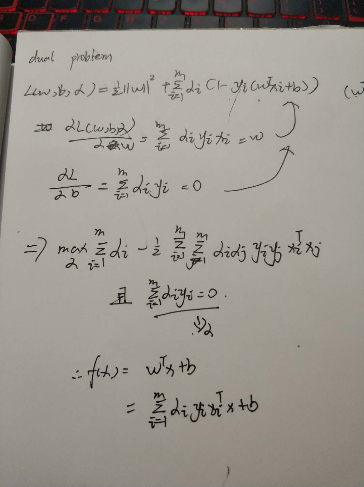
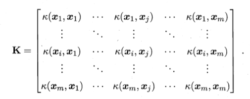
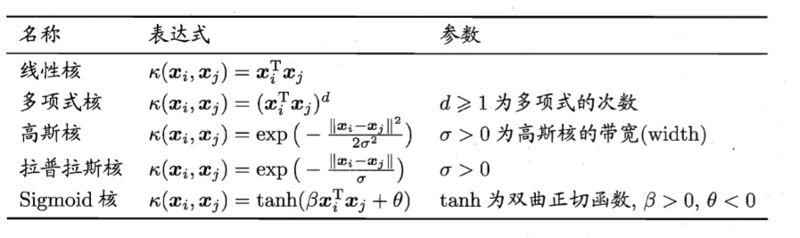
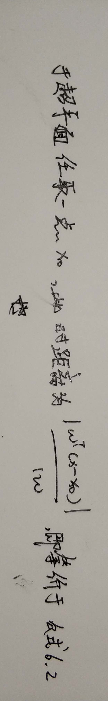

## 对偶问题

## 核函数
 令 X 为输入空间k(·.·) 是定义在 XxX 上的对称函数，则k是核函数当且仅当对于任意数据 D = {X1， x2 ， ... xm}，"核矩阵" (kernel matrix) K 总是半正定的:

## 软间隔与正则化

在现实任务 中往往很难确定合适的核函数使得训练样本在特征空间中线性可分;退一步说， 即使恰好找到了某个核函数使训练集在特征空间中线性可分?也很难断定这个 貌似线性可分的结果不是由于过拟合所造成的.

为了解决这个问题，就是允许支持向量机在一些样本上出错.也就是“软间隔的概念”

软间隔允许某些样本不满足约束在最大化间隔的同时，不满足约束的样本应尽可能少。

## 这是一些比较常用的核函数，如图：

## 支持向量回归

传统回归模型通常直接基于模型输出 f(x) 与真实输出 u 之 间的差别来计算损失，当且仅当 f(x) 与 u 完全相同时，损失才为零.与此不同， 支持向量回归假设我们能容忍 f(x) 与 u 之间最多有 E 的偏差，即仅当 f(x) 与 u 之间的差别绝对值大于 E 时才计算损失.

## 习题

习题没有全部做得来，只把可以做的答案放上来，以后如果做出来了再补上。

1.试证明样本空间中任意点x到超平面(w,b)的距离为式(6.2)。

2.使用libsvm,在西瓜数据集3.0α上分别用线性核和高斯核训练一个SVM,并比较其支持向量的差别。

3.选择两个UCI数据集，分别用线性核和高斯核训练一个SVM，并与BP神经网络和C4.5决策树进行实验比较。

4.讨论线性判别分析与线性核支持向量机在何种情况下等价。

感觉吧，如果在线性可分得情况下，LDA求出来得参数值应该和支持向量机求出来的w应该是垂直的。

5.试述高斯核SVM与RBF神经网络的联系

- RBF和SVM都可以采用高斯核。
- RBF是最小化累计误差，SVM最小化参数

6.试析SVM对噪声敏感的原因。

如果数据出现了噪声对于分类效果影响很大，其实SVM是直接对于数据划分得，相当于分出两类来，然后计算距离这个样子，数据的分布是会直接影响分类的效果的而不是间接的影响。

7.试给出式(6.52)的完整KT条件。

8.以西瓜数据集3.0α的“密度”属性为输入，“含糖率”为输出，使用LIBSVM训练一个SVR。
9.试使用和技巧推广对率回归，产生“核对率回归”。

10.设计一个显著减少SVM中支持向量数目而不显著降低泛化性能的方法。 
对于线性的SVM，三个属性不完全一样的支持向量就能确定这个SVM，而其他的落在边缘上的点都可以舍弃。 